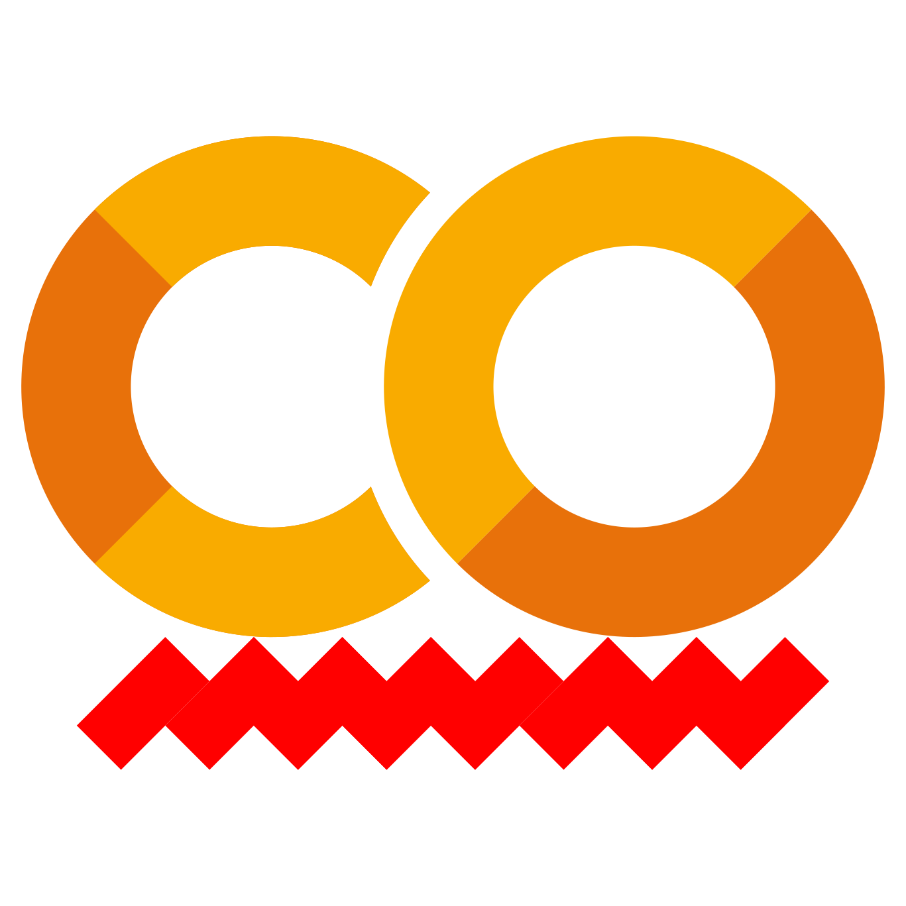

# Google Colab Spellcheck Extension

This repo contains the code for a Chrome extension that spellchecks markdown cells in Google Colab. The extension is available for free on [Chrome Web Store](https://chrome.google.com/webstore/detail/colab-spellcheck/ibnfomklkmoocmbmjlddagkippmndioc).

Spellchecking runs completely **offline, locally** in the extension using a modified BJSpell spellchecker with a bundled English (US) Hunspell-derived dictionary [[1]](https://code.google.com/archive/p/bjspell/source/default/source) [[2]](https://github.com/maheshmurag/bjspell) . This approach is lightweight, but imperfect. Please use the personal dictionary feature to store any valid words this extension initially considers non-words. 

## Set Up

Install the extension from the [Chrome Web Store](https://chrome.google.com/webstore/detail/colab-spellcheck/ibnfomklkmoocmbmjlddagkippmndioc). That's it! No login, no network, all local.

## Usage

Open a Colab notebook, click a markdown cell, and click **Check Active Cell** in the extension popup. The extension will create a table of misspelled words (if present) and suggestions. 

If the extension registers a real word as misspelled, you may click the word in the extension and add it to your personal dictionary. Manage your personal dictionary within settings . 

